# PostrMagic V2: UI Component Inventory

This document serves as a master list for all UI components from the legacy XAMPP project. Its purpose is to ensure that all valuable UI elements are identified, analyzed, and systematically rebuilt in the new Laravel V2 application.

**Global Requirement:** The entire V2 application must support both a light and dark mode theme. A user-selectable toggle should be available to switch between them.

---

## 1. Core Layout Components

### 1.1. Main Dashboard Wrapper

*   **Legacy File(s):** `dashboard.php`, `admin/dashboard.php`
*   **Screenshot:**
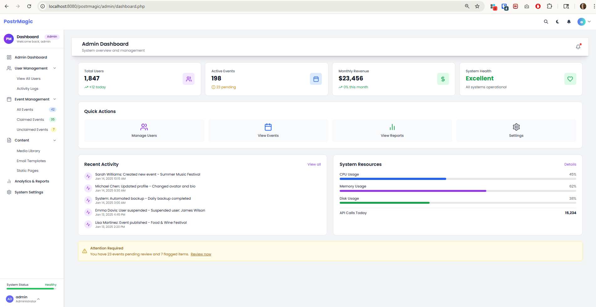
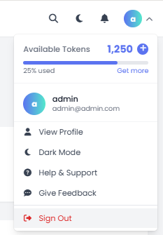
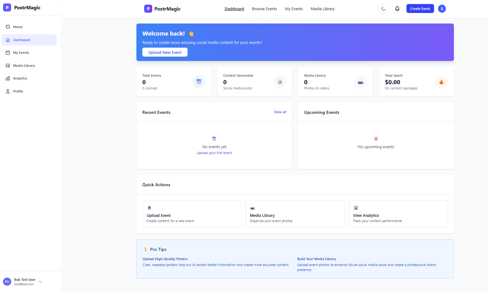
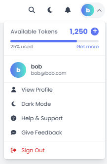
*   **Purpose:** Provides the main structural container for all authenticated pages, including the header, sidebar, and content area.
*   **Data Dependencies:**
    *   `$user`: The currently logged-in user object to determine which sidebar to show (user or admin).
*   **V2 Laravel Mapping:**
    *   **Type:** Blade Layout Component
    *   **Location:** `resources/views/layouts/app.blade.php` (This will be the main wrapper provided by Jetstream, which we will customize).
    *   **Notes:** The theme-switching logic for light/dark mode will be implemented here, likely by toggling a CSS class on the main `<body>` or `<html>` tag and using Tailwind's `dark:` variants for styling.

### 1.2. Shared Dashboard Header

*   **Legacy File(s):** `includes/dashboard-header.php`
*   **Screenshot:**
    *   
*   **Purpose:** Displays the main navigation, user dropdown menu (with links to profile, settings, logout), and potentially a search bar or notifications.
*   **Data Dependencies:**
    *   `$user`: The currently logged-in user object to display their name and avatar.
*   **V2 Laravel Mapping:**
    *   **Type:** Blade Component
    *   **Location:** `resources/views/components/layout/header.blade.php`
    *   **Invocation:** `<x-layout.header />`

### 1.3. User Sidebar

*   **Legacy File(s):** [includes/sidebar-user.php](cci:7://file:///c:/xampp/htdocs/postrmagic/includes/sidebar-user.php:0:0-0:0)
*   **Screenshot:**
    *   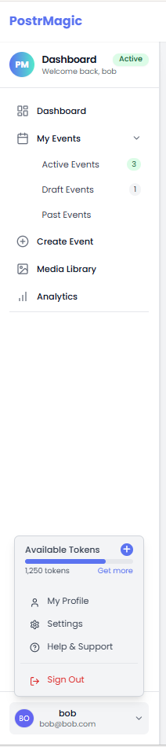
*   **Purpose:** Provides the primary navigation for regular, non-admin users. It includes links for managing their own content and a profile section at the bottom.
*   **Data Dependencies:**
    *   `$user`: A user object with `name` and `email`.
    *   Event counts for "Active" and "Draft" statuses.
    *   Token balance and usage for the footer pop-up widget.
*   **V2 Laravel Mapping:**
    *   **Type:** Blade Component
    *   **Location:** `resources/views/components/layout/sidebar-user.blade.php`
    *   **Invocation:** `<x-layout.sidebar-user />`
    *   **Notes:** The navigation links are user-centric. The pop-up profile menu in the footer is a distinct feature that duplicates some functionality from the main header's dropdown but is scoped to the sidebar.

### 1.4. Admin Sidebar

*   **Legacy File(s):** [includes/sidebar-admin.php](cci:7://file:///c:/xampp/htdocs/postrmagic/includes/sidebar-admin.php:0:0-0:0)
*   **Screenshot:**
    *   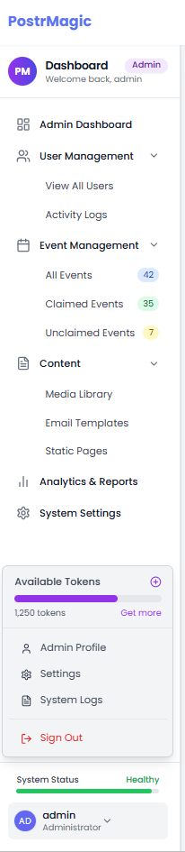
*   **Purpose:** Provides primary navigation for administrators. It features a distinct color scheme and links for system-wide management.
*   **Data Dependencies:**
    *   `$user`: An admin user object with `name`.
    *   Counts for various system metrics (e.g., total events, claimed/unclaimed events).
    *   System health status.
*   **V2 Laravel Mapping:**
    *   **Type:** Blade Component
    *   **Location:** `resources/views/components/layout/sidebar-admin.blade.php`
    *   **Invocation:** `<x-layout.sidebar-admin />`
    *   **Notes:** This sidebar is conditionally loaded based on the user's role. It has completely different navigation items from the user sidebar, focusing on management and administration. It also contains a unique "System Status" widget.

### 1.4. Landing Page Components

#### 1.4.1. Event Showcase Grid

*   **Legacy File(s):** [index.php](cci:7://file:///c:/xampp/htdocs/postrmagic/index.php:0:0-0:0)
*   **Screenshot:**
    *   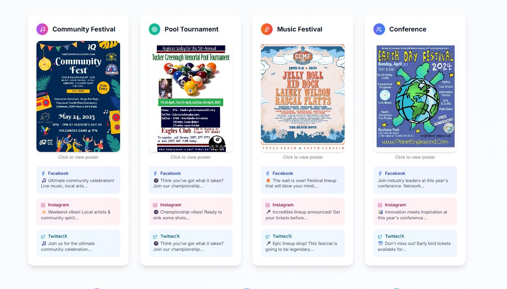
    *   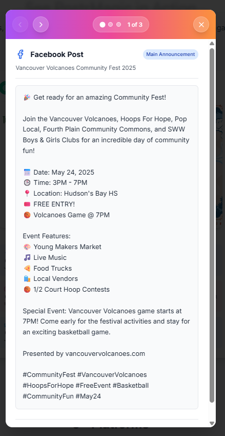
    *   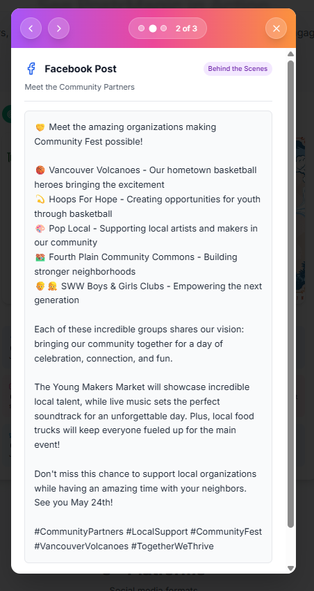
    *   
*   **Purpose:** Demonstrates the core functionality of PostrMagic by showcasing real examples of event posters and their AI-generated social media content. This serves as both a product demonstration and a conversion tool, showing potential users exactly what they can achieve with the platform.
*   **Component Breakdown:**
    *   **Showcase Grid Container:** A responsive grid layout that displays 1-4 event examples depending on screen size (1 column on mobile, 2 on tablet, 4 on desktop).
    *   **Event Card:** Each card represents a different event type (Community Festival, Pool Tournament, Music Festival, Conference) with:
        *   **Event Type Header:** Icon and title identifying the event category
        *   **Poster Thumbnail:** Clickable image preview of the event poster that opens a full-size modal
        *   **Social Media Previews:** Three preview tabs (Facebook, Instagram, Twitter/X) showing snippets of the AI-generated content
    *   **Poster Modal:** A lightbox-style modal that displays the full-size event poster when clicked
    *   **Social Media Post Modal:** An interactive modal with:
        *   **Navigation Bar:** Gradient header with previous/next buttons and position indicators
        *   **Post Counter:** Shows current position (e.g., "1 of 3")
        *   **Platform Indicator:** Shows which platform the post is for (Facebook, Instagram, Twitter/X)
        *   **Post Type Label:** Indicates the post type (announcement, behind-the-scenes, call-to-action)
        *   **Content Display:** Formatted social media post content with emojis and formatting
        *   **Engagement Stats:** Shows likes, comments, shares metrics for the example post
*   **Interactions:**
    *   Clicking a poster thumbnail opens the poster modal
    *   Clicking a social media preview tab opens the social media post modal
    *   Within the social media modal, users can navigate between multiple post examples (typically 3) using arrow buttons or keyboard navigation
    *   The modal includes visual indicators showing the current position in the sequence
*   **Data Dependencies:**
    *   `socialMediaContent`: A JavaScript object containing all the example posts organized by event type and platform
    *   `Test_posters/`: Directory containing sample event poster images
*   **V2 Laravel Mapping:**
    *   **Type:** Blade Component + Alpine.js for interactivity
    *   **Component Location:** `resources/views/components/landing/event-showcase.blade.php`
    *   **Modal Components:** 
        *   `resources/views/components/landing/poster-modal.blade.php`
        *   `resources/views/components/landing/social-post-modal.blade.php`
    *   **Controller:** `app/Http/Controllers/LandingPageController.php` (to provide example data)
    *   **Notes:** This component will use Alpine.js for the modal interactions and carousel functionality. The example content should be stored in a database table rather than hardcoded in JavaScript to allow for easier updates and A/B testing of different examples. The component should be designed to easily swap out different event types and social media post examples.

### 1.5. Dashboard Footer

*   **Legacy File(s):** [includes/dashboard-footer.php](cci:7://file:///c:/xampp/htdocs/postrmagic/includes/dashboard-footer.php:0:0-0:0)
*   **Screenshot:**
    *   N/A (This component has no visual output).
*   **Purpose:** This file does not render a visual footer. It serves two main functions:
    1.  Closes the main HTML tags (`</main>`, `</body>`, `</html>`).
    2.  Contains a large block of inline JavaScript to handle theme (dark/light mode) switching and initialize icons.
*   **Data Dependencies:**
    *   None.
*   **V2 Laravel Mapping:**
    *   **Type:** Not a component. This functionality will be absorbed into other parts of the Laravel application.
    *   **Location:**
        *   The closing HTML tags will be part of the main application layout file: `resources/views/layouts/app.blade.php`.
        *   All JavaScript will be moved to a dedicated file, such as `resources/js/app.js`, and compiled by Vite.
    *   **Notes:** This is a key architectural improvement. Moving inline scripts into a compiled asset file is a best practice that improves performance and maintainability. The theme-switching logic will be preserved and refined within our new asset pipeline.

---

## 2. User Interface Components

### 2.1. User Dashboard

*   **Legacy File(s):** [dashboard.php](cci:7://file:///c:/xampp/htdocs/postrmagic/dashboard.php:0:0-0:0)
*   **Screenshot:**
    *   
*   **Purpose:** Serves as the main landing page for a logged-in user. It provides a summary of their activity, quick access to key features, and a list of their recent work.
*   **Data Dependencies:**
    *   `$stats`: An object/array containing summary statistics (total events, active events, total views, engagement rate, media count).
    *   `$recent_events`: A collection of the user's most recent events, each with an `id`, `title`, `date`, `status`, and `views`.
    *   `$is_admin`: A boolean flag to conditionally display the "Administrator Tools" banner.
*   **V2 Laravel Mapping:**
    *   **Type:** Full-Page Livewire Component
    *   **Route:** `/dashboard`
    *   **Component Location:** `app/Livewire/User/Dashboard.php`
    *   **View Location:** `resources/views/livewire/user/dashboard.blade.php`
    *   **Notes:** This page is a perfect candidate for a Livewire component. The component's class will be responsible for fetching all the necessary data (`$stats`, `$recent_events`) from the database. The Blade view will contain all the HTML for the stats cards, the recent events table, and the quick actions panel. The admin banner will be shown using a simple `@if(auth()->user()->isAdmin())` check.

### 2.2. User Media Management

#### 2.2.1. Media Library Page

*   **Legacy File(s):** [media-library.php](cci:7://file:///c:/xampp/htdocs/postrmagic/media-library.php:0:0-0:0)
*   **Screenshot:**
    *   
*   **Purpose:** Provides a dedicated interface for users to view, manage, and upload their media files. It's a self-contained page that includes statistics, filtering, search, and the media display itself.
*   **Component Breakdown:**
    *   **Stats Bar:** Displays total file count and total storage usage.
    *   **Filter/Search Toolbar:** Allows users to search for media by name and filter by the event it's associated with.
    *   **Media Grid:** A responsive grid displaying thumbnails of all user-owned media.
    *   **Pagination Controls:** For navigating through large collections of media.
    *   **Upload Modal:** A dialog for uploading new files.
*   **Data Dependencies:**
    *   `$stats`: An object with `total_files` and `total_size`.
    *   `$media`: A paginated collection of the user's media items. Each item needs an `id`, `file_path` (for the URL), `file_name`, `file_size`, and `created_at`.
    *   `$events`: A list of the user's events to populate the filter dropdown.
*   **V2 Laravel Mapping:**
    *   **Type:** Full-Page Livewire Component
    *   **Route:** `/media-library`
    *   **Component Location:** `app/Livewire/Media/Library.php`
    *   **View Location:** `resources/views/livewire/media/library.blade.php`
    *   **Notes:** The main Livewire component will manage the overall state, including search terms, filters, and pagination. The backend API logic from the legacy file will be replaced by public methods within this Livewire component (e.g., `deleteMedia()`).

#### 2.2.2. Media Upload Modal

*   **Legacy File(s):** [media-library.php](cci:7://file:///c:/xampp/htdocs/postrmagic/media-library.php:0:0-0:0) (specifically the `#uploadModal` div and the associated JavaScript in the `MediaLibrary` object).
*   **Screenshot:**
    *   
*   **Purpose:** Provides a user-friendly interface for uploading one or more media files. It supports drag-and-drop, file selection, and displays a preview of the selected files before uploading.
*   **UI Elements:**
    *   Drag-and-drop zone.
    *   "Select files" button.
    *   A list to preview selected files (showing name and size).
    *   "Upload" and "Cancel" buttons.
*   **Data Dependencies:**
    *   None for display, but it needs the `event_id` context if the upload is initiated from an event page to properly tag the media.
*   **V2 Laravel Mapping:**
    *   **Type:** Reusable Livewire Component
    *   **Component Location:** `app/Livewire/Media/UploadModal.php`
    *   **View Location:** `resources/views/livewire/media/upload-modal.blade.php`
    *   **Notes:** This will be a highly reusable component utilizing Livewire's `WithFileUploads` trait. It will emit an event (e.g., `mediaUploaded`) upon success, which the parent component can listen for to refresh the media grid. Alpine.js will be used to manage the modal's state and UI feedback.

### 2.3. User Event Management

#### 2.3.1. Events List Page

*   **Legacy File(s):** [events.php](cci:7://file:///c:/xampp/htdocs/postrmagic/events.php:0:0-0:0)
*   **Screenshot:**
    *   
*   **Purpose:** Serves as the primary interface for a user to view, search, and manage all of their created events. It provides a comprehensive overview and entry points for event creation and editing.
*   **Component Breakdown:**
    *   **Page Header:** Displays the "My Events" title and a prominent "Create Event" button that navigates to the event creation page.
    *   **Filter Tabs:** A tabbed navigation bar allowing users to filter the event list by status: `All`, `Active`, `Draft`, and `Past`. Each tab shows a count of the events within that category.
    *   **Search and Sort Toolbar:** Includes a text input for real-time searching by event title or location, and a dropdown menu to sort the events.
    *   **Events Grid:** The main content area, which displays a collection of `Event Card` components in a responsive grid.
    *   **Empty State:** A message that appears when no events match the current search or filter criteria. It includes an icon and a "Create Your First Event" call-to-action.
    *   **Pagination Controls:** Standard previous/next buttons and page numbers to navigate through the list of events.
*   **Data Dependencies:**
    *   `$events`: A paginated collection of the user's events, filtered by the selected status.
    *   `$status_counts`: An object/array containing the total count of events for each status (`all`, `active`, `draft`, `past`).
*   **V2 Laravel Mapping:**
    *   **Type:** Full-Page Livewire Component
    *   **Route:** `/events`
    *   **Component Location:** `app/Livewire/Events/Index.php`
    *   **View Location:** `resources/views/livewire/events/index.blade.php`
    *   **Notes:** This is a prime candidate for a full-page Livewire component. The component's class will manage all state, including the active filter, search query, sort order, and current page. The database query will be built dynamically based on these properties to efficiently fetch the correct data.

#### 2.3.2. Event Card Component

*   **Legacy File(s):** [events.php](cci:7://file:///c:/xampp/htdocs/postrmagic/events.php:0:0-0:0) (specifically the `foreach` loop that renders each event)
*   **Screenshot:**
    *   
*   **Purpose:** A reusable, self-contained visual block that displays a summary of a single event. This component is the core building block of the "Events List Page".
*   **UI Elements:**
    *   **Event Thumbnail:** A prominent image representing the event. A status badge (`Active`, `Draft`, `Past`) is overlaid on the image.
    *   **Event Title:** The full title of the event.
    *   **Event Metadata:** A section displaying key information: event date, location, and the number of social media posts generated for it.
    *   **Last Modified Date:** A timestamp indicating when the event was last updated.
    *   **Action Buttons:** A row of icon-based buttons providing quick access to "View Details," "Edit," "View Analytics," and "Share."
*   **Data Dependencies:**
    *   `$event`: A single event object containing all necessary fields: `id`, `title`, `date`, `location`, `thumbnail`, `posts_generated`, and `last_modified`.
*   **V2 Laravel Mapping:**
    *   **Type:** Reusable Blade Component
    *   **Location:** `resources/views/components/events/card.blade.php`
    *   **Invocation:** `<x-events.card :event="$event" />`
    *   **Notes:** This will be a stateless Blade component that receives the `$event` object as a prop. It will be responsible solely for rendering the event's data. All actions will be handled by standard HTML links (e.g., the "View Details" and "Edit" buttons will link to the appropriate routes).

#### 2.3.3. Event Create/Edit Form

*   **Legacy File(s):** [event-creation.php](cci:7://file:///c:/xampp/htdocs/postrmagic/event-creation.php:0:0-0:0)
*   **Screenshot:**
    *   
*   **Purpose:** Provides a comprehensive, multi-section form for users to input all the necessary details for creating a new event. The same form is used for editing an existing event, where it would be pre-populated with the event's current data.
*   **Component Breakdown:**
    *   **Basic Information Section:** A group of fields for core event details, including Title, Location, Event Date, Contact Name, Event Type, and Contact Email/Phone.
    *   **Description Section:** A textarea for a detailed description of the event.
    *   **Event Media Section:** Two distinct file upload zones: one for a required "Event Poster" and another for optional "Additional Media". Both feature drag-and-drop capabilities.
    *   **Social Media Section:** A series of input fields for linking to various social media pages (Facebook, Instagram, Twitter, etc.) and defining an official event hashtag.
    *   **Form Actions:** "Save Event" and "Cancel" buttons to submit or discard the form.
*   **Data Dependencies:**
    *   When editing, an `$event` object is required to pre-populate all form fields with existing data.
    *   For the "Submitted On" field, it depends on the user's timezone setting (currently hardcoded).
*   **V2 Laravel Mapping:**
    *   **Type:** Full-Page Livewire Component
    *   **Route:** `/events/create`, `/events/{event}/edit`
    *   **Component Location:** `app/Livewire/Events/CreateEditForm.php`
    *   **View Location:** `resources/views/livewire/events/create-edit-form.blade.php`
    *   **Notes:** This is an ideal use case for a single Livewire component to handle both create and edit modes. The component will manage form state, real-time validation, file uploads with previews (using `WithFileUploads`), and the final submission logic. In edit mode, the `mount()` method will receive the event model and populate the public properties bound to the form fields.

#### 2.3.4. Event Details Page

*   **Legacy File(s):** [event-detail.php](cci:7://file:///c:/xampp/htdocs/postrmagic/event-detail.php:0:0-0:0)
*   **Screenshot:**
    *   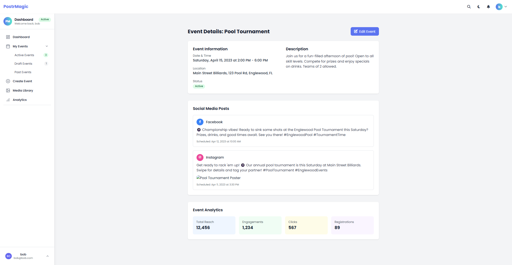
*   **Purpose:** Provides a comprehensive view of a single event with all its details, metrics, and management options. This is the main interface for users to view and manage a specific event after it has been created.
*   **Component Breakdown:**
    *   **Back Navigation:** A simple link to return to the events list page.
    *   **Event Header Section:**
        *   **Event Image:** Displays the event poster/thumbnail image.
        *   **Event Info:** Shows the event title, status badge, date, time, location, organizer, and contact information.
        *   **Event Description:** Detailed text description of the event.
        *   **Action Buttons:** Edit, Delete, Share, and Add to Calendar buttons.
        *   **Quick Stats:** Shows views, shares, and engagement metrics in a horizontal grid.
    *   **Tabs Navigation:**
        *   **Content Tab:** Shows AI-generated social media content for the event.
        *   **Analytics Tab:** Displays detailed performance metrics and charts.
        *   **Settings Tab:** Provides access to event configuration options.
    *   **Tab Content Areas:** Each tab has its own content container that is shown/hidden based on tab selection.
*   **Interactions:**
    *   Clicking tabs switches between Content, Analytics, and Settings views.
    *   Action buttons trigger appropriate modals or navigations (Edit, Delete, Share).
    *   Back button returns to the events list.
*   **Data Dependencies:**
    *   `$event`: An object containing all event details including:
        *   Basic info: `id`, `title`, `date`, `time`, `location`, `description`, `status`, `organizer`, `contact`, `thumbnail`
        *   Metrics: `views`, `shares`, `engagement`
    *   Content data for the Content tab (AI-generated posts)
    *   Analytics data for the Analytics tab (charts and metrics)
    *   Settings data for the Settings tab (configuration options)
*   **V2 Laravel Mapping:**
    *   **Type:** Full-Page Livewire Component with nested tab components
    *   **Route:** `/events/{event}` (where `{event}` is the event ID)
    *   **Component Location:** `app/Livewire/Events/Show.php`
    *   **View Location:** `resources/views/livewire/events/show.blade.php`
    *   **Tab Components:**
        *   Content Tab: `app/Livewire/Events/Tabs/Content.php` with view `resources/views/livewire/events/tabs/content.blade.php`
        *   Analytics Tab: `app/Livewire/Events/Tabs/Analytics.php` with view `resources/views/livewire/events/tabs/analytics.blade.php`
        *   Settings Tab: `app/Livewire/Events/Tabs/Settings.php` with view `resources/views/livewire/events/tabs/settings.blade.php`
    *   **Notes:** The V2 implementation will use Livewire's tab component system to handle the tab switching without page reloads. Each tab will be a separate Livewire component that can be lazy-loaded to improve performance. The event data will be loaded once in the parent component and passed to the tab components as needed.

### 2.4. User Profile & Settings
*To be documented*

---

## 3. Admin Interface Components

### 3.1. Admin Dashboard

*   **Legacy File(s):** [admin/dashboard.php](cci:7://file:///c:/xampp/htdocs/postrmagic/admin/dashboard.php:0:0-0:0)
*   **Screenshot:**
    *   
*   **Purpose:** Provides a comprehensive, high-level overview of the entire platform for administrators. It focuses on system-wide statistics, resource monitoring, recent activity, and quick access to management tools.
*   **Data Dependencies:**
    *   `$stats`: An object/array with system-level statistics (total users, active events, revenue, new users today, pending events, CPU/memory/disk usage, API calls).
    *   `$recentActivity`: A collection of the latest activity logs from across the system.
*   **V2 Laravel Mapping:**
    *   **Type:** Full-Page Livewire Component
    *   **Route:** `/admin/dashboard` (protected by admin middleware)
    *   **Component Location:** `app/Livewire/Admin/Dashboard.php`
    *   **View Location:** `resources/views/livewire/admin/dashboard.blade.php`
    *   **Notes:** This will be a dedicated Livewire component separate from the user dashboard. It will fetch aggregate data and system metrics. The component will likely have polling enabled for the "Recent Activity" and "System Resources" panels to provide a near real-time view. Access will be restricted to users with an `is_admin` flag via route middleware.

### 3.2. Admin Media Management

#### 3.2.1. Global Media Library

*   **Legacy File(s):** [admin/media.php](cci:7://file:///c:/xampp/htdocs/postrmagic/admin/media.php:0:0-0:0), [admin/media-backend.php](cci:7://file:///c:/xampp/htdocs/postrmagic/admin/media-backend.php:0:0-0:0)
*   **Screenshot:**
    *   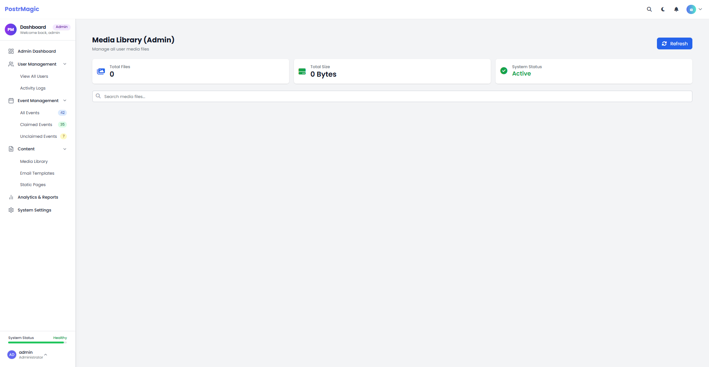
*   **Purpose:** Provides a centralized, system-wide view of all media uploaded by all users. This interface is for administrative and moderation purposes, allowing admins to search, review, and delete any media file on the platform.
*   **Component Breakdown:**
    *   **Global Stats:** Displays system-wide media statistics, such as total files, total storage used, and average files per user.
    *   **Global Search/Filter Toolbar:** A powerful search bar allowing admins to find media by filename, username, or event.
    *   **Media Table/Grid:** Unlike the user's simple grid, this is a more detailed table view. Each row displays the media thumbnail, filename, the username of the owner, the upload date, and a "Delete" button.
    *   **Pagination Controls:** Standard pagination for the media table.
*   **Data Dependencies:**
    *   `$media_items`: A paginated collection of all media from all users, joined with the `users` table to display usernames.
    *   `$system_stats`: An object containing the global media statistics.
*   **V2 Laravel Mapping:**
    *   **Type:** Full-Page Livewire Component
    *   **Route:** `/admin/media` (protected by admin middleware)
    *   **Component Location:** `app/Livewire/Admin/Media/Index.php`
    *   **View Location:** `resources/views/livewire/admin/media/index.blade.php`
    *   **Notes:** This component is functionally distinct from the user's media library. It queries the media table without a `user_id` constraint. The search functionality will be more complex, querying across both the `media` and `users` tables. The delete action will require an admin-specific authorization check.

### 3.3. Admin Event Management

*   **Legacy File(s):** [admin/events.php](cci:7://file:///c:/xampp/htdocs/postrmagic/admin/events.php:0:0-0:0)
*   **Screenshot:**
    *   
*   **Purpose:** Provides administrators with a comprehensive interface to monitor, manage, and moderate all events created by users across the platform. This includes approving pending events, reviewing flagged content, and accessing detailed event metrics.
*   **Component Breakdown:**
    *   **Page Header:** Title, description, and action buttons (Export, Settings)
    *   **Stats Cards:** Four cards showing key metrics:
        *   Total Events: Count of all events in the system
        *   Pending Approval: Count of events awaiting admin review
        *   Flagged Content: Count of events flagged for potential issues
        *   Active Events: Count of currently active events
    *   **Filter Tabs:** Navigation tabs to filter events by status (All, Pending, Flagged, Active)
    *   **Search and Actions Bar:**
        *   Search input for filtering events by title or creator
        *   Bulk selection controls
        *   Bulk actions dropdown
    *   **Events Table:** Detailed table with the following columns:
        *   Checkbox for bulk selection
        *   Event details (thumbnail, title, date, location)
        *   Creator information (name, email)
        *   Status with badges (active, pending, flagged)
        *   Metrics (views, engagement)
        *   Last modified timestamp
        *   Action buttons (view, edit, approve, suspend)
    *   **Pagination:** Controls for navigating through event pages
*   **Interactions:**
    *   Clicking filter tabs changes the displayed events list
    *   Search input filters events in real-time
    *   Bulk selection allows for mass actions on multiple events
    *   Individual action buttons for per-event management
    *   Pagination controls for navigating through event pages
*   **Data Dependencies:**
    *   `$events`: A collection of all events with detailed information including:
        *   Basic info: `id`, `title`, `date`, `location`, `thumbnail`
        *   Status info: `status`, `flagged`
        *   Creator info: `creator`, `creator_email`
        *   Metrics: `views`, `engagement`, `posts_generated`
        *   Timestamps: `last_modified`
    *   `$filter_counts`: Counts of events by filter category (all, active, pending, flagged)
*   **V2 Laravel Mapping:**
    *   **Type:** Full-Page Livewire Component with nested components
    *   **Route:** `/admin/events` (protected by admin middleware)
    *   **Component Location:** `app/Livewire/Admin/Events/Index.php`
    *   **View Location:** `resources/views/livewire/admin/events/index.blade.php`
    *   **Nested Components:**
        *   Stats Cards: `app/Livewire/Admin/Events/StatsCards.php`
        *   Events Table: `app/Livewire/Admin/Events/Table.php`
    *   **Notes:** The V2 implementation will leverage Livewire's real-time filtering and pagination capabilities. The table component will include sorting functionality and the ability to approve/suspend events without page reloads. The bulk actions will be implemented using Livewire's action handling with confirmation modals for destructive actions.

### 3.4. User Profile Page

*   **Legacy File(s):** [user-profile.php](cci:7://file:///c:/xampp/htdocs/postrmagic/user-profile.php:0:0-0:0)
*   **Screenshot:**
    *   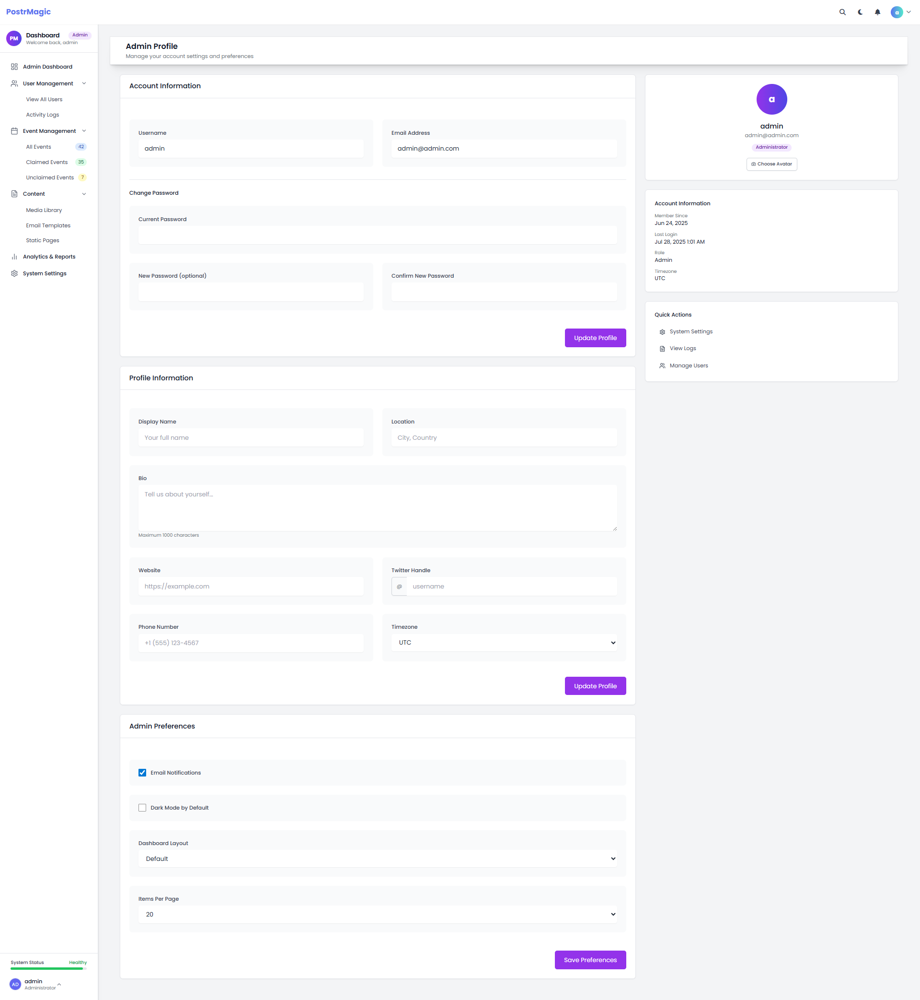
*   **Purpose:** Provides users with a dedicated page to view and manage their profile information, including personal details, bio, avatar, and social links.
*   **Component Breakdown:**
    *   **Profile Header:** Visual section with:
        *   Cover photo with gradient background
        *   User avatar with upload/change functionality
        *   User name and bio
        *   Edit profile button
    *   **Personal Information Section:**
        *   Form fields for name, bio, location, website
        *   Character counter for bio text
        *   Social media handles
    *   **Contact Information Section:**
        *   Email address (read-only)
        *   Phone number
        *   Timezone selector
*   **Interactions:**
    *   Toggle between view and edit modes
    *   Avatar upload with preview
    *   Avatar deletion
    *   Form validation for fields
    *   Save/cancel actions for profile edits
*   **Data Dependencies:**
    *   `$currentUser`: User object containing:
        *   Basic info: `username`, `display_name`, `email`
        *   Profile details: `bio`, `location`, `website`, `twitter_handle`, `phone`
        *   Preferences: `timezone`
        *   Avatar path: `avatar`
*   **V2 Laravel Mapping:**
    *   **Type:** Full-Page Livewire Component
    *   **Route:** `/profile`
    *   **Component Location:** `app/Livewire/Profile/Show.php`
    *   **View Location:** `resources/views/livewire/profile/show.blade.php`
    *   **Nested Components:**
        *   Avatar Upload: `app/Livewire/Profile/AvatarUploader.php`
        *   Profile Editor: `app/Livewire/Profile/Editor.php`
    *   **Notes:** The V2 implementation will leverage Livewire's real-time validation and file upload capabilities. The profile page will use Alpine.js for the toggle between view and edit modes. Avatar uploads will be processed through Laravel's file storage system with automatic image optimization.

### 3.5. User Settings Page

*   **Legacy File(s):** [settings.php](cci:7://file:///c:/xampp/htdocs/postrmagic/settings.php:0:0-0:0)
*   **Screenshot:**
    *   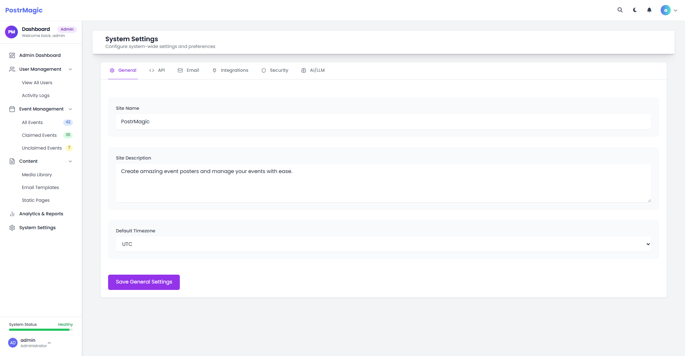
*   **Purpose:** Provides users with a centralized interface to manage their account settings, security preferences, and notification options.
*   **Component Breakdown:**
    *   **Page Header:** Title and description
    *   **Account Information Section:**
        *   Username field
        *   Email address field
        *   Password change fields (current, new, confirm)
        *   Save button
    *   **Notification Preferences Section:**
        *   Email notifications toggle
        *   Event reminders toggle
        *   Marketing emails toggle
        *   Save button
    *   **Appearance Settings Section:**
        *   Dark mode toggle
        *   Timezone selector
        *   Save button
    *   **Account Management Section:**
        *   Delete account button
        *   Password reset link
        *   Warning text about account deletion
    *   **Delete Account Modal:**
        *   Warning message
        *   Password confirmation field
        *   Cancel/Delete buttons
*   **Interactions:**
    *   Form validation for all input fields
    *   Toggle switches for preferences
    *   Modal confirmation for account deletion
    *   Password strength validation
*   **Data Dependencies:**
    *   `$currentUser`: User object with account details
    *   `$preferences`: User preferences object containing:
        *   `email_notifications`: Boolean
        *   `event_reminders`: Boolean
        *   `dark_mode`: Boolean
        *   `timezone`: String
*   **V2 Laravel Mapping:**
    *   **Type:** Multiple Livewire Components
    *   **Route:** `/settings`
    *   **Component Locations:**
        *   `app/Livewire/Settings/AccountInformation.php`
        *   `app/Livewire/Settings/NotificationPreferences.php`
        *   `app/Livewire/Settings/AppearanceSettings.php`
        *   `app/Livewire/Settings/AccountManagement.php`
    *   **View Locations:**
        *   `resources/views/livewire/settings/account-information.blade.php`
        *   `resources/views/livewire/settings/notification-preferences.blade.php`
        *   `resources/views/livewire/settings/appearance-settings.blade.php`
        *   `resources/views/livewire/settings/account-management.blade.php`
    *   **Notes:** The V2 implementation will split the settings page into multiple Livewire components for better maintainability and performance. Each section will handle its own validation and saving logic. The account deletion functionality will use a confirmation modal with password verification. Dark mode preferences will be stored in both the database and local storage for persistence.

### 3.6. Admin User Management

*   **Legacy File(s):** [admin/user-management.php](cci:7://file:///c:/xampp/htdocs/postrmagic/admin/user-management.php:0:0-0:0)
*   **Screenshot:**
    *   
*   **Purpose:** Provides administrators with a comprehensive interface to manage user accounts, including creating new users, editing user details, assigning roles, and monitoring user statuses.
*   **Component Breakdown:**
    *   **Page Header:** Title and description
    *   **Stats Cards:** Four cards showing key metrics:
        *   Total Users: Count of all users in the system
        *   Active Users: Count of currently active users
        *   Pending Users: Count of users awaiting approval
        *   Suspended Users: Count of users with suspended accounts
    *   **Filters and Search Bar:**
        *   Search input for finding users by name or email
        *   Role filter dropdown (All, Admin, User)
        *   Status filter dropdown (All, Active, Pending, Suspended)
        *   Apply Filters button
    *   **Users Table:** Detailed table with the following columns:
        *   User details (avatar, name, email)
        *   Role (Admin or User with appropriate badges)
        *   Status (Active, Pending, Suspended with color-coded badges)
        *   Registration date
        *   Last login timestamp
        *   Action buttons (edit, suspend/activate, delete, view activity)
    *   **Add/Edit User Modal:**
        *   Form fields for name, email, and role
        *   Save and Cancel buttons
*   **Interactions:**
    *   Search and filter functionality for finding specific users
    *   Add new user via modal form
    *   Edit existing user details
    *   Suspend/activate user accounts
    *   Delete user accounts with confirmation
    *   View user activity history
*   **Data Dependencies:**
    *   `$users`: Collection of user objects containing:
        *   Basic info: `id`, `name`, `email`, `avatar`
        *   Role info: `role` (admin or user)
        *   Status info: `status` (active, pending, suspended)
        *   Timestamps: `created_at`, `last_login`
    *   `$userCounts`: Counts of users by status category (total, active, suspended, pending)
*   **V2 Laravel Mapping:**
    *   **Type:** Full-Page Livewire Component with nested components
    *   **Route:** `/admin/users` (protected by admin middleware)
    *   **Component Location:** `app/Livewire/Admin/Users/Index.php`
    *   **View Location:** `resources/views/livewire/admin/users/index.blade.php`
    *   **Nested Components:**
        *   Stats Cards: `app/Livewire/Admin/Users/StatsCards.php`
        *   Users Table: `app/Livewire/Admin/Users/Table.php`
        *   User Modal: `app/Livewire/Admin/Users/UserModal.php`
    *   **Notes:** The V2 implementation will leverage Livewire's real-time filtering and pagination capabilities. The table component will include sorting functionality and the ability to suspend/activate users without page reloads. User deletion will require confirmation and will be handled through a modal dialog. The system will implement proper authorization checks to prevent admins from modifying super-admin accounts or their own role.

### 3.7. System Settings

*   **Legacy File(s):** [admin/settings.php](cci:7://file:///c:/xampp/htdocs/postrmagic/admin/settings.php:0:0-0:0)
*   **Screenshot:**
    *   
*   **Purpose:** Provides administrators with a comprehensive interface to configure and manage system-wide settings, including API keys, email templates, LLM configurations, and security options.
*   **Component Breakdown:**
    *   **Settings Navigation:** Tabbed interface with sections for:
        *   General Settings
        *   API Configuration
        *   Integrations & Security
        *   Email Templates
        *   AI/LLM Configuration
    *   **General Settings Section:**
        *   Site name and description
        *   File upload limits
        *   Default timezone
        *   User registration settings
    *   **API Configuration Section:**
        *   API key management for third-party services
        *   Test connection buttons
        *   Usage statistics
    *   **Integrations & Security Section:**
        *   Social media platform connections
        *   Security settings (password policies, session timeouts)
        *   IP whitelisting/blacklisting
    *   **Email Templates Section:**
        *   Template editor for system emails
        *   Variable insertion helpers
        *   Preview and test sending functionality
    *   **AI/LLM Configuration Section:**
        *   Provider selection (OpenAI, Anthropic, Gemini)
        *   Model selection and parameters
        *   Cost tracking and usage limits
        *   Prompt templates management
*   **Interactions:**
    *   Tab navigation between setting sections
    *   Form validation for all configuration fields
    *   Test connection functionality for APIs
    *   Preview functionality for email templates
    *   Save/reset buttons for each section
*   **Data Dependencies:**
    *   `$systemSettings`: Object containing all system configuration values
    *   `$emailTemplates`: Collection of email template objects
    *   `$apiKeys`: Collection of API key configurations
    *   `$llmConfigurations`: Collection of LLM provider configurations
*   **V2 Laravel Mapping:**
    *   **Type:** Multiple Livewire Components with Tab Navigation
    *   **Route:** `/admin/settings` (protected by admin middleware)
    *   **Component Locations:**
        *   `app/Livewire/Admin/Settings/Index.php` (Main container)
        *   `app/Livewire/Admin/Settings/General.php`
        *   `app/Livewire/Admin/Settings/Api.php`
        *   `app/Livewire/Admin/Settings/Security.php`
        *   `app/Livewire/Admin/Settings/EmailTemplates.php`
        *   `app/Livewire/Admin/Settings/LlmConfiguration.php`
    *   **View Locations:**
        *   `resources/views/livewire/admin/settings/index.blade.php`
        *   `resources/views/livewire/admin/settings/general.blade.php`
        *   `resources/views/livewire/admin/settings/api.blade.php`
        *   `resources/views/livewire/admin/settings/security.blade.php`
        *   `resources/views/livewire/admin/settings/email-templates.blade.php`
        *   `resources/views/livewire/admin/settings/llm-configuration.blade.php`
    *   **Notes:** The V2 implementation will use Laravel's config system for storing and retrieving settings, with database overrides for dynamic values. The email template editor will include a WYSIWYG interface with variable insertion. API keys will be encrypted in the database. The LLM configuration will include a cost estimation calculator based on selected models and parameters.

### 3.8. Email Template Management

*   **Legacy File(s):** [admin/email-templates.php](cci:7://file:///c:/xampp/htdocs/postrmagic/admin/email-templates.php:0:0-0:0)
*   **Screenshot:**
    *   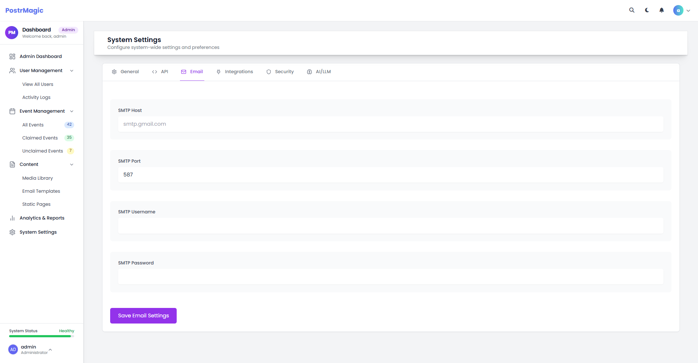
*   **Purpose:** Provides administrators with a dedicated interface to create, edit, and manage email templates used throughout the system for notifications, user communications, and marketing.
*   **Component Breakdown:**
    *   **Templates List:** Table of available email templates with:
        *   Template name
        *   Description
        *   Last modified date
        *   Status indicator (active/inactive)
        *   Action buttons (edit, preview, duplicate, delete)
    *   **Template Editor:**
        *   Subject line input
        *   Rich text editor for email body
        *   Variable insertion dropdown
        *   HTML/Visual toggle
        *   Preview panel showing rendered email
    *   **Template Settings:**
        *   Template name and description
        *   Category selection
        *   Status toggle (active/inactive)
        *   Default sender name and email
*   **Interactions:**
    *   CRUD operations for email templates
    *   Real-time preview of template with variable substitution
    *   Test sending functionality to admin email
    *   Variable insertion into editor at cursor position
*   **Data Dependencies:**
    *   `$emailTemplates`: Collection of template objects with:
        *   `id`, `name`, `description`, `subject`, `body_html`, `body_text`
        *   `category`, `status`, `variables`, `last_modified`
    *   `$templateVariables`: List of available variables by category
*   **V2 Laravel Mapping:**
    *   **Type:** Livewire Component with nested editor
    *   **Route:** `/admin/email-templates` (protected by admin middleware)
    *   **Component Locations:**
        *   `app/Livewire/Admin/EmailTemplates/Index.php`
        *   `app/Livewire/Admin/EmailTemplates/Editor.php`
    *   **View Locations:**
        *   `resources/views/livewire/admin/email-templates/index.blade.php`
        *   `resources/views/livewire/admin/email-templates/editor.blade.php`
    *   **Notes:** The V2 implementation will use a WYSIWYG editor component (TipTap or CKEditor) integrated with Livewire. Templates will be stored in the database but with filesystem fallbacks for default templates. The system will support Markdown and HTML formats with automatic plain text generation. Template variables will be validated against available data sources to prevent errors in production emails.

## 4. User-Facing Pages

### 4.1. Help Center

*   **Legacy File(s):** `help.php`
*   **Screenshot:** 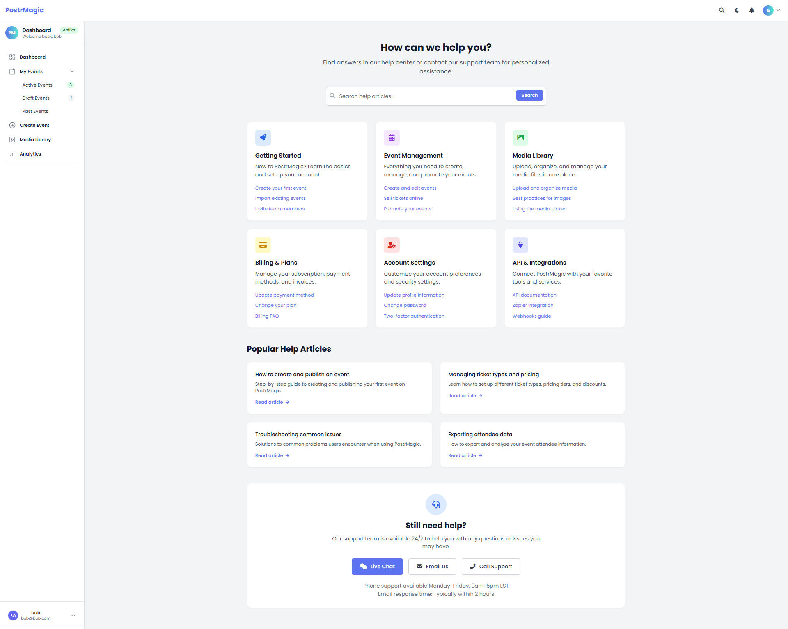
*   **Purpose:** Provides users with a searchable knowledge base, categorized help articles, and support contact options.
*   **Component Breakdown:**
    *   **Search Bar:** Prominent search functionality for help articles
    *   **Help Categories:** Grid of categorized help topics including:
        *   Getting Started
        *   Event Management
        *   Media Library
        *   Account Settings
        *   Integrations
    *   **Popular Articles:** Featured help content with previews
    *   **Contact Support Section:** Multiple support channels (email, chat, phone)
*   **Interactions:**
    *   Search functionality for finding specific help topics
    *   Category navigation for browsing related articles
    *   Direct links to support channels
*   **Data Dependencies:**
    *   `$helpArticles`: Collection of help content organized by category
    *   `$popularArticles`: Curated list of frequently accessed help topics
    *   `$supportChannels`: Available support contact methods
*   **V2 Laravel Mapping:**
    *   **Type:** Livewire Component with Search
    *   **Route:** `/help` (protected by auth middleware)
    *   **Component Locations:**
        *   `app/Livewire/Help/Index.php`
        *   `app/Livewire/Help/Search.php`
        *   `app/Livewire/Help/Article.php`
    *   **View Locations:**
        *   `resources/views/livewire/help/index.blade.php`
        *   `resources/views/livewire/help/search.blade.php`
        *   `resources/views/livewire/help/article.blade.php`
    *   **Notes:** The V2 implementation will use a database-driven knowledge base with full-text search capabilities. Articles will be stored with categories, tags, and related article links. The search functionality will use Laravel Scout with a driver appropriate for production needs.

### 4.2. Billing & Subscription Management

*   **Legacy File(s):** `billing.php`
*   **Screenshot:** 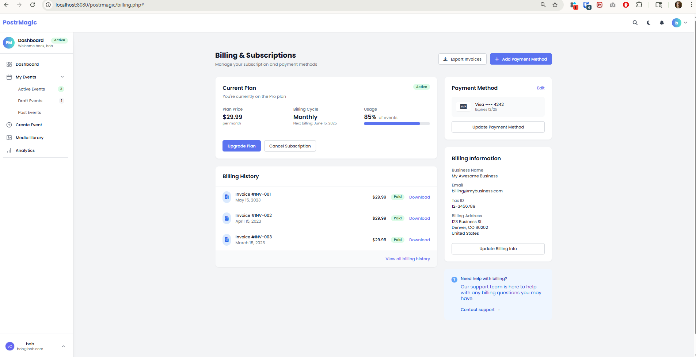
*   **Purpose:** Provides users with a comprehensive interface to view and manage their subscription details, payment methods, billing history, and billing information. Enables users to upgrade plans, cancel subscriptions, update payment methods, and download invoices.
*   **Component Breakdown:**
    *   **Header Section:**
        *   Page title and description
        *   Action buttons (Export Invoices, Add Payment Method)
    *   **Current Plan Card:**
        *   Plan name display with status indicator (active/cancelled)
        *   Plan details grid with three columns:
            *   Plan Price with billing frequency
            *   Billing Cycle with next billing date
            *   Usage visualization with progress bar
        *   Plan action buttons (Upgrade Plan, Cancel Subscription)
    *   **Billing History Section:**
        *   Table of past invoices with:
            *   Invoice ID and date
            *   Amount and status indicators (color-coded)
            *   Download link for each invoice
        *   "View all billing history" link
    *   **Payment Method Card:**
        *   Current payment method display with:
            *   Card type icon
            *   Masked card number (last 4 digits)
            *   Expiration date
        *   Update Payment Method button
    *   **Billing Information Card:**
        *   Business Name
        *   Billing Email
        *   Tax ID
        *   Billing Address
        *   Update Billing Info button
    *   **Support Section:**
        *   Help information for billing inquiries
        *   Contact support link
*   **Interactions:**
    *   **Plan Management:**
        *   Upgrade Plan: Opens plan selection modal with available plans and pricing
        *   Cancel Subscription: Opens confirmation dialog with cancellation options and consequences
    *   **Payment Method Management:**
        *   Add/Update Payment Method: Opens secure form to input new payment details
        *   Edit existing payment method: Opens form pre-populated with current details (masked for security)
    *   **Invoice Management:**
        *   Download individual invoices: Generates PDF invoice for download
        *   Export all invoices: Creates ZIP or combined PDF of all invoices within selected date range
    *   **Billing Information:**
        *   Update billing information: Opens form pre-populated with current billing details
*   **Data Dependencies:**
    *   `subscriptions` table:
        *   `id`: Primary key
        *   `user_id`: Foreign key to users table
        *   `plan_id`: Foreign key to subscription_plans table
        *   `status`: Subscription status (active, cancelled, past_due)
        *   `current_period_start`: Start date of current billing period
        *   `current_period_end`: End date of current billing period (next billing date)
        *   `cancel_at_period_end`: Boolean indicating if subscription will cancel at end of period
        *   `payment_method_id`: Current payment method
        *   `created_at`: Subscription creation date
        *   `updated_at`: Last update timestamp
    *   `payment_methods` table:
        *   `id`: Primary key
        *   `user_id`: Foreign key to users table
        *   `type`: Card type (Visa, Mastercard, etc.)
        *   `last4`: Last 4 digits of card
        *   `expiry_month`: Card expiration month
        *   `expiry_year`: Card expiration year
        *   `is_default`: Boolean indicating if this is the default payment method
        *   `created_at`: Creation timestamp
        *   `updated_at`: Last update timestamp
    *   `invoices` table:
        *   `id`: Primary key
        *   `user_id`: Foreign key to users table
        *   `subscription_id`: Foreign key to subscriptions table
        *   `invoice_number`: Unique invoice number (e.g., INV-001)
        *   `amount`: Invoice amount
        *   `status`: Payment status (Paid, Pending, Failed)
        *   `billing_date`: Date invoice was issued
        *   `pdf_url`: URL to generated PDF invoice
        *   `created_at`: Creation timestamp
        *   `updated_at`: Last update timestamp
    *   `billing_information` table:
        *   `id`: Primary key
        *   `user_id`: Foreign key to users table
        *   `business_name`: Name of business
        *   `email`: Billing email address
        *   `tax_id`: Tax or VAT identification number
        *   `address_line1`: First line of address
        *   `address_line2`: Optional second line of address
        *   `city`: City
        *   `state`: State or province
        *   `postal_code`: ZIP or postal code
        *   `country`: Country
        *   `created_at`: Creation timestamp
        *   `updated_at`: Last update timestamp
*   **V2 Laravel Mapping:**
    *   **Type:** Multiple Livewire Components
    *   **Route:** `/billing` (protected by auth middleware)
    *   **Component Locations:**
        *   `app/Livewire/Billing/Index.php` (Main container)
        *   `app/Livewire/Billing/CurrentPlan.php`
        *   `app/Livewire/Billing/InvoiceHistory.php`
        *   `app/Livewire/Billing/PaymentMethod.php`
        *   `app/Livewire/Billing/BillingInfo.php`
    *   **View Locations:**
        *   `resources/views/livewire/billing/index.blade.php`
        *   `resources/views/livewire/billing/current-plan.blade.php`
        *   `resources/views/livewire/billing/invoice-history.blade.php`
        *   `resources/views/livewire/billing/payment-method.blade.php`
        *   `resources/views/livewire/billing/billing-info.blade.php`
    *   **Notes:** The V2 implementation will utilize Laravel Cashier for subscription management with either Stripe or Paddle integration. All payment processing will be handled securely through these third-party services. The interface will maintain the same clean, user-friendly design with added responsive improvements for mobile users. Support for multiple payment methods per user will be added, along with enhanced invoice customization options. Subscription upgrade/downgrade processes will include prorated billing calculations. Additional features will include customizable dashboards where administrators can rearrange components, expanded export options including scheduled automated reports, and advanced tax handling for international compliance.

## 5. Admin-Specific Pages

### 5.1. Admin Analytics Dashboard

*   **Legacy File(s):** `admin/analytics.php`
*   **Screenshot:** 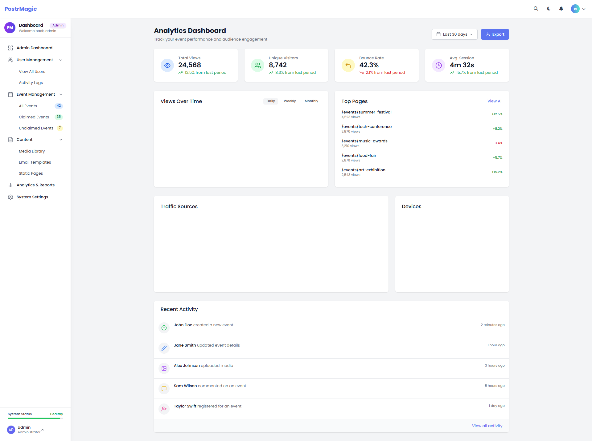
*   **Purpose:** Provides administrators with a comprehensive overview of site performance, user activity, and engagement metrics. Enables data-driven decision-making through visual representations of key performance indicators.
*   **Component Breakdown:**
    *   **Header Section:**
        *   Page title and description
        *   Date range selector dropdown (Last 7/30/90 days, This year)
        *   Export button for analytics data
    *   **Key Metrics Cards (Statistics Overview):**
        *   Total Views card with trend indicator
        *   Unique Visitors card with trend indicator
        *   Bounce Rate card with trend indicator
        *   Average Session Duration card with trend indicator
    *   **Views Over Time Chart:**
        *   Line chart showing traffic trends
        *   Toggle between Daily/Weekly/Monthly views
        *   Interactive tooltips with detailed data points
    *   **Top Pages Section:**
        *   Tabular list of most viewed pages/events
        *   View counts and change percentage indicators
        *   "View All" link for complete data
    *   **Traffic Sources Chart:**
        *   Doughnut chart showing traffic acquisition channels
        *   Breakdown by Direct, Organic Search, Social, Email, and Referral traffic
        *   Percentage and count data in tooltips
    *   **Devices Chart:**
        *   Doughnut chart showing device category distribution
        *   Breakdown by Desktop, Mobile, and Tablet usage
        *   Visual color-coding for easy identification
    *   **Recent Activity Feed:**
        *   Chronological list of user activities on the platform
        *   Color-coded icons representing different action types
        *   Timestamps and user identifiers
        *   "View all activity" link for complete activity log
*   **Interactions:**
    *   **Date Range Selection:**
        *   Click dropdown to select different time periods for all analytics data
        *   UI updates dynamically to reflect the selected time range
    *   **Chart Interactions:**
        *   Hover over data points to view detailed metrics
        *   Click on chart legends to toggle data series visibility
        *   Click between Daily/Weekly/Monthly views to change data granularity
    *   **Data Export:**
        *   Export button generates reports in multiple formats (CSV, PDF)
        *   Can export either specific sections or comprehensive reports
    *   **Navigation to Details:**
        *   "View All" links lead to dedicated detailed views for specific metrics
        *   Click on individual pages in Top Pages to view detailed page analytics
        *   Click on "View all activity" to see complete activity logs
*   **Data Dependencies:**
    *   `site_analytics` table:
        *   `id`: Primary key
        *   `page_url`: URL of the page viewed
        *   `visitor_id`: Anonymous visitor identifier
        *   `user_id`: Authenticated user ID (nullable)
        *   `timestamp`: When the view occurred
        *   `duration`: Time spent on page in seconds
        *   `source`: Traffic source (direct, search, social, etc.)
        *   `medium`: Traffic medium (cpc, organic, referral, etc.)
        *   `device_type`: Device category (desktop, mobile, tablet)
        *   `browser`: User browser information
        *   `country`: Country of visitor
        *   `region`: Region/state of visitor
        *   `is_bounce`: Boolean indicating if this was a bounce visit
        *   `created_at`: Record creation timestamp
    *   `user_activities` table:
        *   `id`: Primary key
        *   `user_id`: Foreign key to users table
        *   `action_type`: Type of action performed (create, update, comment, etc.)
        *   `action_details`: JSON data with context-specific action details
        *   `entity_type`: Type of entity acted upon (event, media, etc.)
        *   `entity_id`: ID of the entity acted upon
        *   `created_at`: When the activity occurred
    *   `admin_dashboard_cache` table:
        *   `id`: Primary key
        *   `metric_type`: Type of cached metric (views_over_time, top_pages, etc.)
        *   `time_period`: Period covered (daily, weekly, monthly, etc.)
        *   `date_range_start`: Start date for the data
        *   `date_range_end`: End date for the data
        *   `cache_data`: JSON blob of pre-calculated metrics
        *   `created_at`: When cache was generated
        *   `expires_at`: When cache expires
*   **V2 Laravel Mapping:**
    *   **Type:** Multiple Livewire Components with Chart.js integration
    *   **Route:** `/admin/analytics` (protected by admin middleware)
    *   **Component Locations:**
        *   `app/Livewire/Admin/Analytics/Index.php` (Main container)
        *   `app/Livewire/Admin/Analytics/StatsOverview.php`
        *   `app/Livewire/Admin/Analytics/ViewsChart.php`
        *   `app/Livewire/Admin/Analytics/TopPages.php`
        *   `app/Livewire/Admin/Analytics/TrafficSources.php`
        *   `app/Livewire/Admin/Analytics/DevicesChart.php`
        *   `app/Livewire/Admin/Analytics/RecentActivity.php`
    *   **View Locations:**
        *   `resources/views/livewire/admin/analytics/index.blade.php`
        *   `resources/views/livewire/admin/analytics/stats-overview.blade.php`
        *   `resources/views/livewire/admin/analytics/views-chart.blade.php`
        *   `resources/views/livewire/admin/analytics/top-pages.blade.php`
        *   `resources/views/livewire/admin/analytics/traffic-sources.blade.php`
        *   `resources/views/livewire/admin/analytics/devices-chart.blade.php`
        *   `resources/views/livewire/admin/analytics/recent-activity.blade.php`
    *   **Notes:** The V2 implementation will use Laravel's Blade and Livewire with AlpineJS for enhanced interactivity. Chart.js will be integrated for data visualization with the option to toggle between light and dark themes for charts. Real-time updates will be implemented using Livewire's polling feature to refresh dashboard data periodically. Additional features will include customizable dashboards where administrators can rearrange components, expanded export options including scheduled automated reports, and advanced filtering capabilities to analyze data by user segments or content categories.

### 5.2. LLM Settings & Management Interface

*   **Legacy File(s):** `admin/llm-settings.php`, `includes/llm-manager.php`, `includes/llm-prompt-manager.php`
*   **Screenshot:**
    *   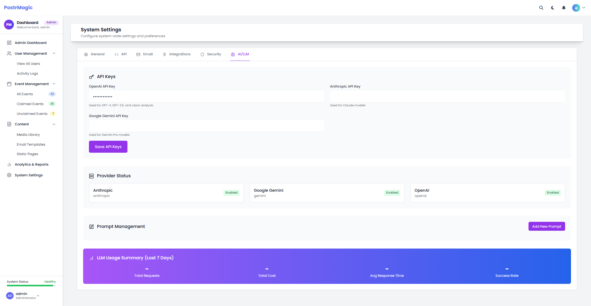
*   **Purpose:** Provides administrators with a comprehensive toolset to configure, manage, test, and monitor all aspects of the AI language model integration within PostrMagic. It enables flexible assignment of LLM providers and models to specific processes, manages prompt versioning, facilitates prompt testing, and tracks usage costs across the system.
*   **Component Breakdown:**
    *   **Tabbed Navigation Structure:**
        *   Providers Tab: Configuration of LLM providers, API keys, and process assignments
        *   Prompts Tab: Management of prompts with versioning for different content types
        *   Testing Tab: Interface for testing prompts with sample data and viewing results
        *   Analytics Tab: Cost tracking, usage statistics, and performance metrics
    *   **Providers Tab:**
        *   Provider Configuration Table: List of configured providers with status indicators
        *   Priority ordering controls for fallback sequence
        *   Model selection dropdowns per provider and content type
        *   Enable/disable toggles for each configuration
        *   Add Configuration Form: Provider, content type, event category, and model selection
    *   **Prompts Tab:**
        *   Prompt Filtering Controls: Filter by type, category, content type
        *   Prompts Table: List with type, category, version number, and actions
        *   Add/Edit Prompt Form: Type selection, prompts fields, version notes
        *   Placeholder reference helpers for dynamic content insertion
    *   **Testing Tab:**
        *   Prompt Selection: Dropdown to select prompt for testing
        *   Test Data Input: JSON editor for test input data
        *   Test Results Area: Output display, response metadata, save option
        *   Comparison view for A/B testing between prompts or models
    *   **Analytics Tab:**
        *   Summary Statistics Cards: Total API requests, cost, response time, success rate
        *   Time Range Selector: Preset periods and custom date range picker
        *   Analytics Tables: Usage by provider, model, content type, process
        *   Cost Visualization Charts: Trends and breakdowns
*   **Interactions:**
    *   **Provider Configuration:**
        *   Add, edit, and delete provider configurations
        *   Set priority order for fallback sequence
        *   Toggle switches for enabling/disabling providers
        *   Priority drag-and-drop reordering
    *   **Prompt Management:**
        *   Create new prompts for different processes and content types
        *   Edit existing prompts (creates new version automatically)
        *   View version history with diff comparisons
        *   Rollback to previous versions
        *   Delete prompts (with confirmation)
        *   Dynamic placeholder insertion
    *   **Testing Workflow:**
        *   Select prompt to test
        *   Enter test data matching prompt placeholders
        *   Run test against actual API
        *   View formatted results
        *   Save test results for comparison
        *   A/B test different prompt versions or models
        *   Rate test results qualitatively
    *   **Analytics Interactions:**
        *   Filter by date range
        *   Filter by provider, model, or content type
        *   Export data to CSV
        *   Toggle between different visualization views
*   **Data Dependencies:**
    *   `llm_providers`: Table containing provider information
    *   `llm_configurations`: Table containing provider configurations
    *   `llm_prompts`: Table containing prompts and their versions
    *   `llm_prompt_versions`: Table containing historical prompt versions
    *   `llm_usage_logs`: Table containing detailed API call logs
    *   `llm_cost_tracking`: Table containing aggregated cost data
*   **V2 Laravel Mapping:**
    *   **Type:** Multiple Livewire Components with Tab Navigation
    *   **Route:** `/admin/llm-settings` (protected by admin middleware)
    *   **Component Locations:**
        *   `app/Livewire/Admin/LLM/Index.php` (Main container)
        *   `app/Livewire/Admin/LLM/Providers.php`
        *   `app/Livewire/Admin/LLM/Prompts.php`
        *   `app/Livewire/Admin/LLM/Testing.php`
        *   `app/Livewire/Admin/LLM/Analytics.php`
    *   **View Locations:**
        *   `resources/views/livewire/admin/llm/index.blade.php`
        *   `resources/views/livewire/admin/llm/providers.blade.php`
        *   `resources/views/livewire/admin/llm/prompts.blade.php`
        *   `resources/views/livewire/admin/llm/testing.blade.php`
        *   `resources/views/livewire/admin/llm/analytics.blade.php`
    *   **Notes:** The V2 implementation will maintain or enhance the robust provider management and prompt versioning system from V1. OpenRouter will be added as a new provider alongside OpenAI and Anthropic. Process-specific model assignment will be enhanced to allow more granular control. Testing interface will be expanded to include A/B testing and performance visualizations. Cost tracking will be enhanced with budgeting capabilities and more detailed analytics. The entire interface will be rebuilt with Laravel Livewire, maintaining high interactivity. API keys will be encrypted in the database using Laravel's encryption facilities.

## 6. API & Integration Components

### 6.1. API Endpoints Documentation

*   **Legacy File(s):** `api/media.php`, `api/profile-update.php`
*   **Screenshot:** (to be added later)
*   **Purpose:** Provides programmatic access to PostrMagic functionality for integration with external systems and services.
*   **Component Breakdown:**
    *   **Media API Endpoints:**
        *   `GET /api/v1/media`: List media items with optional filtering
        *   `POST /api/v1/media`: Upload new media files
        *   `PUT /api/v1/media/{id}`: Update media metadata
        *   `DELETE /api/v1/media/{id}`: Remove media items
        *   `GET /api/v1/media/tags`: Retrieve available media tags
        *   `POST /api/v1/media/search`: Search media by various criteria
        *   `GET /api/v1/media/stats`: Retrieve media usage statistics
    *   **Profile API Endpoints:**
        *   `PUT /api/v1/profile`: Update user profile information
        *   `POST /api/v1/profile/avatar`: Upload user avatar
*   **Interactions:**
    *   Authentication via API key or session token
    *   JSON request and response format
    *   File upload handling for media and avatars
    *   Error handling with appropriate HTTP status codes
*   **Data Dependencies:**
    *   `$_GET['action']`: Action parameter determining endpoint behavior
    *   `$_POST` data: Request payload for create/update operations
    *   `$_FILES` data: Uploaded file information
    *   Database access for CRUD operations
*   **V2 Laravel Mapping:**
    *   **Type:** RESTful API Controllers with Laravel Sanctum Authentication
    *   **Routes:** Defined in `routes/api.php`
    *   **Controller Locations:**
        *   `app/Http/Controllers/Api/MediaController.php`
        *   `app/Http/Controllers/Api/ProfileController.php`
    *   **Resource Locations:**
        *   `app/Http/Resources/MediaResource.php`
        *   `app/Http/Resources/UserResource.php`
    *   **Notes:** The V2 implementation will follow RESTful API design principles with proper resource-based URLs, versioning (v1), comprehensive documentation using OpenAPI/Swagger, and authentication via Laravel Sanctum. API rate limiting and caching will be implemented for performance and security.

## 7. Authentication & Error Pages

### 7.1. Authentication Flow Components

*   **Legacy File(s):** `login.php`, `reset-password.php`, `index.php` (registration functionality)
*   **Screenshot:** (to be created during V2 buildout)
*   **Purpose:** Provides complete authentication flow including login, password reset, and user registration.
*   **Component Breakdown:**
    *   **Login Form:**
        *   Email/username input field
        *   Password input field with show/hide toggle
        *   Remember me checkbox
        *   Login button
        *   Password reset link
        *   Registration link/button
    *   **Password Reset Flow:**
        *   Email input for password reset request
        *   Email confirmation message
        *   Password reset form with new password and confirmation
        *   Success confirmation
    *   **Registration Form:**
        *   Name input field
        *   Email input field
        *   Password and confirmation fields
        *   Terms & conditions checkbox
        *   Registration button
*   **Interactions:**
    *   Form validation with inline error messages
    *   AJAX submission with loading indicators
    *   Success/failure feedback
    *   Redirection after successful authentication
    *   Remember me cookie handling
*   **Data Dependencies:**
    *   User authentication database tables
    *   Session management
    *   CSRF protection tokens
*   **V2 Laravel Mapping:**
    *   **Type:** Laravel Fortify/Jetstream Authentication
    *   **Locations:**
        *   Login: `resources/views/auth/login.blade.php`
        *   Registration: `resources/views/auth/register.blade.php`
        *   Password Reset Request: `resources/views/auth/forgot-password.blade.php`
        *   Password Reset Form: `resources/views/auth/reset-password.blade.php`
    *   **Notes:** Laravel V2 will leverage built-in authentication scaffolding via Jetstream with Livewire for the entire authentication flow, with custom styling to match the PostrMagic brand. Features will include email verification, two-factor authentication options, and rate limiting for security.

### 7.2. Error Page Components

*   **Legacy File(s):** `404.php`, *(other potential error pages)*
*   **Screenshot:** (to be added later)
*   **Purpose:** Provides user-friendly error messages when pages cannot be found or errors occur.
*   **Component Breakdown:**
    *   **404 Not Found Page:**
        *   Error code display (404)
        *   Friendly error message
        *   Navigation link back to home
        *   Consistent styling with main application
    *   **Other Error Pages:**
        *   500 Server Error
        *   403 Forbidden
        *   401 Unauthorized
        *   Maintenance mode page
*   **Interactions:**
    *   One-click return to main application
    *   Optional error reporting functionality
*   **Data Dependencies:**
    *   None specific, except for application styling
*   **V2 Laravel Mapping:**
    *   **Type:** Laravel Error Pages
    *   **Locations:**
        *   `resources/views/errors/404.blade.php`
        *   `resources/views/errors/500.blade.php`
        *   `resources/views/errors/403.blade.php`
        *   `resources/views/errors/401.blade.php`
        *   `resources/views/errors/503.blade.php` (maintenance mode)
    *   **Notes:** Laravel provides a simple way to customize error pages. Each error type will have a dedicated template inheriting from a master error layout. Error tracking will be implemented for admin review, and all error pages will maintain consistent styling with the rest of the application.
